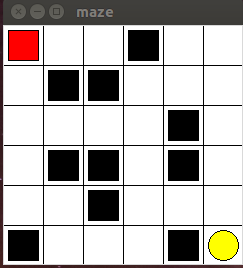
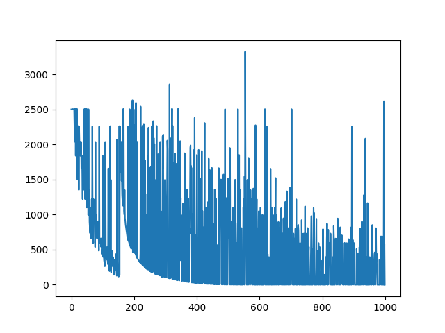
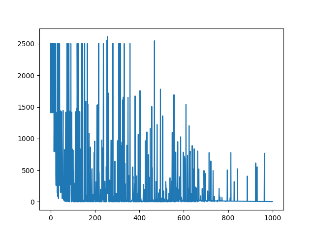

# 2. Q-learning Maze
- 使用q-learning进行迷宫探索，建立q表记录Q值
- 动作为 上 下 左 右
- 迷宫环境使用扩展后的maze_env_extend*.py
- 具体的奖励方式为：
  1. 当碰到障碍物、墙壁 奖励值-50
  2. 下一步如果离终点更近，奖励+1
  3. 如果下一步离终点更远，奖励-1  
- Rl.py 执行强化学习的程序
- 使用Q-func对奖励值作为目标函数
  - Q-func = sum((q-predict - q-target)^2)
- 贝尔曼方程(Bellman Equation)中，γ为折扣因子，α为学习速率。
γ越大，无人车会越重视以前的经验，越小就更重视眼前利益。 
α取值范围为0~1，取值越大，保留之前训练的效果就越少。 
可以看出当α取值为0时，无论如何训练AI也无法学习到新Q值；
α取值为1时，新Q值将完全取代旧Q值，每次训练得到新值就会完全忘记之前的训练结果。 
这些参数值都是人为设定的，需要根据经验慢慢调整。
- 本次实验采用两种策略：
  1. 学习率、折扣因子、探索率随着时间变化进行调整。学习率下降，折扣因子增大，探索率下降，
  仿真出探索的越多越重视经验，学习效果下滑，更加熟悉环境减少不必要的冒险的效果
  2. 三个参数取固定值
- 环境图：黄色为终点，黑色为障碍物

- Q-func：

